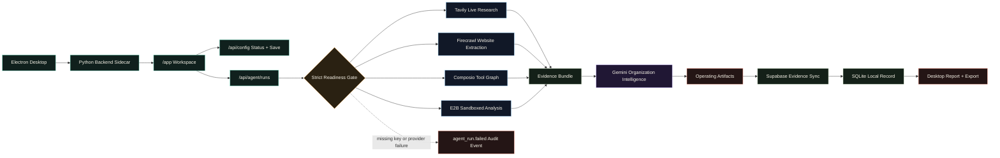

<div align="center">


# CivAgent Desktop

### Installable organization intelligence software for companies deploying AI agents into real operations.

[](#quick-start)
[](#architecture)
[](#required-stack)
[](#supabase-schema)

**CivAgent Desktop researches a company, verifies live evidence, maps deployable agent teams, runs sandbox analysis, synchronizes proof to Supabase, and exports company-grade operating artifacts.**

[Quick Start](#quick-start) · [Workflow](#workflow) · [Interactive Diagram](docs/workflow-diagram.html) · [Architecture](docs/ARCHITECTURE.md) · [Deployment](docs/DEPLOYMENT.md) · [Security](docs/SECURITY.md)

</div>

---

## Download v1.0.0

The public desktop installers are published from the [`v1.0.0` GitHub Release](https://github.com/YukiCodepth/CivAgent/releases/tag/v1.0.0) after the release workflow completes.

| Platform | Installer |
| --- | --- |
| macOS | [`CivAgent-Desktop-1.0.0-mac-arm64.dmg`](https://github.com/YukiCodepth/CivAgent/releases/download/v1.0.0/CivAgent-Desktop-1.0.0-mac-arm64.dmg) |
| macOS ZIP | [`CivAgent-Desktop-1.0.0-mac-arm64.zip`](https://github.com/YukiCodepth/CivAgent/releases/download/v1.0.0/CivAgent-Desktop-1.0.0-mac-arm64.zip) |
| Windows | [`CivAgent-Desktop-1.0.0-win-x64.exe`](https://github.com/YukiCodepth/CivAgent/releases/download/v1.0.0/CivAgent-Desktop-1.0.0-win-x64.exe) |
| Linux | [`CivAgent-Desktop-1.0.0-linux-x86_64.AppImage`](https://github.com/YukiCodepth/CivAgent/releases/download/v1.0.0/CivAgent-Desktop-1.0.0-linux-x86_64.AppImage) |

The app starts a local backend, opens the `/app` workspace, stores integration settings locally with masked readiness, and requires Gemini, Tavily, Supabase, Firecrawl, Composio, and E2B before a real run can complete.

## What CivAgent Does

CivAgent is split into two surfaces:

| Surface | Role |
| --- | --- |
| **Product website** | Public website at `/` for positioning, architecture, security, stack, and app launch/download guidance. |
| **Desktop software** | Electron app that starts a local Python backend, opens `/app`, stores masked integration settings locally, and runs the real agent workflow. |

Every completed run requires Gemini, Tavily, Supabase, Firecrawl, Composio, and E2B to be configured and successful. Supabase sync must complete before CivAgent marks a run as completed.

## Architecture

```text
Electron Desktop
  -> starts Python backend sidecar on 127.0.0.1
  -> opens /app workspace after /api/health succeeds
  -> desktop settings save required integrations locally
  -> /api/agent/runs coordinates external tools
  -> Gemini generates company operating artifacts
  -> Supabase sync completes before local SQLite evidence is saved
```

Core runtime:

| Component | Role |
| --- | --- |
| `index.html` | Public product website for CivAgent Desktop. |
| `app.html` / `script.js` | Desktop workspace, integration settings, traces, sources, approvals, reports, and exports. |
| `desktop/main.js` | Electron shell that owns backend startup, health wait, app window, and shutdown. |
| `server.py` | Static server, config API, real-agent orchestration, provider calls, Supabase sync, SQLite evidence, and audit logging. |
| `docs/workflow-diagram.html` | Movable, zoomable architecture walkthrough. |

## Required Stack

Desktop users can save these values in the app Integrations panel. Server deployments can copy `.env.example` to `.env`.

```env
AI_PROVIDER=gemini
GEMINI_API_KEY=...
GEMINI_MODEL=gemini-3-flash-preview
TAVILY_API_KEY=...

SUPABASE_URL=...
SUPABASE_PUBLISHABLE_KEY=...
SUPABASE_SECRET_KEY=...

FIRECRAWL_API_KEY=...
COMPOSIO_API_KEY=...
E2B_API_KEY=...
```

| Required System | Purpose |
| --- | --- |
| Gemini | Organization intelligence and artifact generation |
| Tavily | Live market and company research |
| Firecrawl | Required website extraction |
| Composio | SaaS/action toolkit graph |
| E2B | Sandboxed ROI, workflow, and risk analysis |
| Supabase | Cloud evidence store for runs, artifacts, sources, tool calls, and approvals |

## Quick Start

```bash
cd "/Users/aman_shh/Documents/New project 2"
npm install
npm run setup:python
npm run brand:icons
npm run check
npm run desktop:dev
```

Server-only development:

```bash
npm start
```

Open:

```text
http://localhost:8080
http://localhost:8080/app
```

Desktop distribution:

```bash
npm run backend:build
npm run desktop:dist
```

Publish a tri-platform public release by pushing a version tag:

```bash
git tag v1.0.0
git push origin main
git push origin v1.0.0
```

## Workflow

The README diagram is GitHub-safe Mermaid. For a zoomable and movable version, open [`docs/workflow-diagram.html`](docs/workflow-diagram.html).



## API

| Method | Endpoint | Purpose |
| --- | --- | --- |
| `GET` | `/api/health` | Service health and required integration status |
| `GET` | `/api/bootstrap` | Latest profile, saved runs, audit events, config readiness, and integration readiness |
| `GET` | `/api/config/status` | Masked desktop integration settings and readiness |
| `POST` | `/api/config` | Save local desktop integration settings |
| `GET` | `/api/integrations` | Full readiness gate details |
| `POST` | `/api/agent/runs` | Execute the fully connected organization intelligence run |
| `GET` | `/api/agent/runs` | List saved real-agent runs |
| `GET` | `/api/agent/runs/:id/export` | Export run JSON and markdown report |
| `GET` | `/api/audit` | Audit event history |

## Supabase Schema

Create these tables in the Supabase SQL editor before running the connected workflow.

```sql
create table if not exists agent_runs (
  id text primary key,
  workspace_id text not null,
  created_at timestamptz not null,
  status text not null,
  model text not null,
  integrations jsonb not null,
  profile jsonb not null,
  result jsonb not null,
  markdown_report text not null
);

create table if not exists agent_artifacts (
  id text primary key,
  run_id text not null,
  created_at timestamptz not null,
  artifact_type text not null,
  title text not null,
  content jsonb not null
);

create table if not exists agent_sources (
  id text primary key,
  run_id text not null,
  created_at timestamptz not null,
  provider text not null,
  title text not null,
  url text not null,
  snippet text not null
);

create table if not exists tool_calls (
  id text primary key,
  run_id text not null,
  created_at timestamptz not null,
  tool_name text not null,
  status text not null,
  input jsonb not null,
  output jsonb not null
);

create table if not exists approvals (
  id text primary key,
  run_id text not null,
  created_at timestamptz not null,
  title text not null,
  policy text not null,
  required boolean not null default true
);
```

## Demo Checklist

- `npm run check` passes.
- Product website opens at `/`.
- Desktop workspace opens at `/app`.
- Desktop Integrations panel saves masked local settings through `/api/config`.
- With missing keys, the Run button stays locked and `/api/agent/runs` returns a non-success error.
- With all keys, Tavily, Firecrawl, Composio, E2B, Gemini, and Supabase evidence appears in the workspace.
- Electron dev mode launches the backend, loads `/app`, and stops the backend when the window exits.

## Supporting Docs

- [Architecture](docs/ARCHITECTURE.md)
- [Deployment](docs/DEPLOYMENT.md)
- [Security](docs/SECURITY.md)
- [Interactive Workflow Diagram](docs/workflow-diagram.html)
