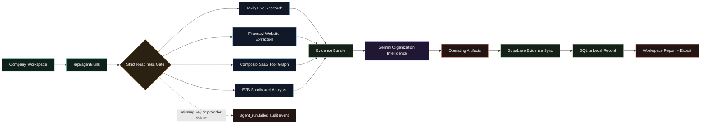

<div align="center">

# CivAgent

### Fully connected organization intelligence for companies deploying AI agents into real operations.

[](#architecture)
[](#required-stack)
[](#supabase-schema)
[](#required-stack)

**CivAgent researches a company, verifies live evidence, maps deployable agent teams, runs sandbox analysis, synchronizes proof to Supabase, and exports company-grade operating artifacts.**

[Run Locally](#quick-start) · [Workflow](#workflow) · [Interactive Diagram](docs/workflow-diagram.html) · [Architecture](docs/ARCHITECTURE.md) · [Deployment](docs/DEPLOYMENT.md) · [Security](docs/SECURITY.md)

</div>

---

## What CivAgent Does

CivAgent is a real agentic operating workspace, not a static product concept. A completed run requires every connected system to be ready and successful.

| Layer | What It Does |
| --- | --- |
| **Company Workspace** | Captures organization, website, market, thesis, operating scale, autonomy policy, and risk tolerance. |
| **Readiness Gate** | Blocks execution until Gemini, Tavily, Supabase, Firecrawl, Composio, and E2B are all configured. |
| **Live Research** | Uses Tavily for market/company discovery and Firecrawl for required website extraction. |
| **Tool Graph** | Uses Composio to discover SaaS/action toolkits for future operational execution. |
| **Sandbox Analysis** | Uses E2B to calculate ROI, workflow, readiness, and risk signals in an isolated runtime. |
| **Agent Reasoning** | Uses Gemini to generate the deployable operating model and executive artifacts. |
| **Evidence Sync** | Requires Supabase sync before a run is marked completed, with SQLite retained as local evidence storage. |

## Architecture

```text
Frontend workspace
  -> Python product API
  -> strict integration readiness
  -> live research + website extraction + SaaS tool graph + sandbox analysis
  -> Gemini organization intelligence
  -> Supabase evidence sync
  -> saved artifacts, audit trail, and exportable report
```

Core runtime:

| Component | Role |
| --- | --- |
| `index.html` / `styles.css` / `script.js` | Product website, workspace UI, integration readiness, traces, sources, approvals, and reports. |
| `server.py` | Static server, JSON API, real-agent orchestration, provider calls, Supabase sync, SQLite evidence, and audit logging. |
| `data/civagent.sqlite` | Local evidence database created at runtime and ignored by Git. |
| `docs/workflow-diagram.html` | Movable, zoomable workflow diagram for demos and walkthroughs. |

## Required Stack

Create `.env` from `.env.example` and fill every value below.

```env
HOST=127.0.0.1
PORT=8080
CIVAGENT_DB=data/civagent.sqlite

AI_PROVIDER=gemini
GEMINI_API_KEY=...
GEMINI_MODEL=gemini-3-flash-preview
TAVILY_API_KEY=...

SUPABASE_URL=...
SUPABASE_PUBLISHABLE_KEY=...
SUPABASE_SECRET_KEY=...

FIRECRAWL_API_KEY=...
COMPOSIO_API_KEY=...
E2B_API_KEY=...
```

The Run button remains locked until the full stack is ready:

| Required System | Purpose |
| --- | --- |
| Gemini | Organization intelligence and artifact generation |
| Tavily | Live market and company research |
| Supabase | Cloud evidence store for runs, artifacts, sources, tool calls, and approvals |
| Firecrawl | Required website extraction |
| Composio | SaaS/action toolkit graph |
| E2B | Sandboxed ROI, workflow, and risk analysis |

## Quick Start

```bash
cd "/Users/aman_shh/Documents/New project 2"
npm run setup:python
npm run check
npm start
```

Open the workspace:

```text
http://localhost:8080
```

If port `8080` is already in use:

```bash
PORT=8081 npm start
```

## Workflow

The README diagram is GitHub-safe Mermaid. For a zoomable and movable version, open [`docs/workflow-diagram.html`](docs/workflow-diagram.html).



## Product Flow

1. Open the company workspace.
2. Enter organization, website, market, operating thesis, team size, planned agents, risk tolerance, autonomy policy, and horizon.
3. CivAgent checks `/api/integrations` and keeps execution locked until every required provider is ready.
4. The agent calls Tavily, Firecrawl, Composio, and E2B to build an evidence bundle.
5. Gemini generates the company operating model, artifacts, roles, approvals, and executive summary.
6. Supabase sync must succeed before the run is saved as completed.
7. The workspace renders live sources, tool calls, approval policies, audit events, saved runs, and exportable reports.

## API

| Method | Endpoint | Purpose |
| --- | --- | --- |
| `GET` | `/api/health` | Service health and required integration status |
| `GET` | `/api/bootstrap` | Latest profile, agent runs, audit events, and integration readiness |
| `GET` | `/api/integrations` | Full readiness gate details |
| `POST` | `/api/agent/runs` | Execute the fully connected organization intelligence run |
| `GET` | `/api/agent/runs` | List saved real-agent runs |
| `GET` | `/api/agent/runs/:id` | Retrieve one real-agent run |
| `GET` | `/api/agent/runs/:id/export` | Export run JSON and markdown report |
| `GET` | `/api/audit` | Audit event history |

## Supabase Schema

Create these tables in the Supabase SQL editor before running the connected workflow.

```sql
create table if not exists agent_runs (
  id text primary key,
  workspace_id text not null,
  created_at timestamptz not null,
  status text not null,
  model text not null,
  integrations jsonb not null,
  profile jsonb not null,
  result jsonb not null,
  markdown_report text not null
);

create table if not exists agent_artifacts (
  id text primary key,
  run_id text not null,
  created_at timestamptz not null,
  artifact_type text not null,
  title text not null,
  content jsonb not null
);

create table if not exists agent_sources (
  id text primary key,
  run_id text not null,
  created_at timestamptz not null,
  provider text not null,
  title text not null,
  url text not null,
  snippet text not null
);

create table if not exists tool_calls (
  id text primary key,
  run_id text not null,
  created_at timestamptz not null,
  tool_name text not null,
  status text not null,
  input jsonb not null,
  output jsonb not null
);

create table if not exists approvals (
  id text primary key,
  run_id text not null,
  created_at timestamptz not null,
  title text not null,
  policy text not null,
  required boolean not null default true
);
```

Keep `SUPABASE_SECRET_KEY` server-side only.

## Demo Checklist

- `npm run check` passes.
- `/api/health` shows all required integrations ready.
- Website URL is filled before running the agent.
- `/api/agent/runs` completes only after Tavily, Firecrawl, Composio, E2B, Gemini, and Supabase succeed.
- The workspace shows sources, tool calls, approvals, saved run, audit event, and export action.
- [`docs/workflow-diagram.html`](docs/workflow-diagram.html) opens for the zoomable architecture walkthrough.

## Supporting Docs

- [Architecture](docs/ARCHITECTURE.md)
- [Deployment](docs/DEPLOYMENT.md)
- [Security](docs/SECURITY.md)
- [Interactive Workflow Diagram](docs/workflow-diagram.html)

