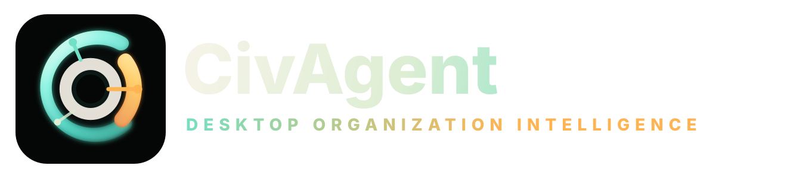
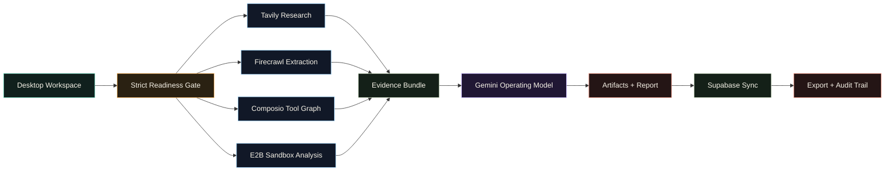

<div align="center">



# CivAgent Desktop

### Company-grade organization intelligence software for deploying AI agents into real operations.

[](https://github.com/YukiCodepth/CivAgent/releases/tag/v1.0.1)
[](#-download)
[](#-required-stack)
[](#-required-stack)

**CivAgent researches a company, verifies live evidence, designs an agent operating model, runs sandbox analysis, syncs proof to Supabase, and exports board-ready artifacts.**

[Download](#-download) · [Quick Start](#-quick-start) · [Workflow](#-workflow) · [Docs](#-docs)

</div>

---

## ⚡ Download

Install CivAgent Desktop from the public [`v1.0.1` release](https://github.com/YukiCodepth/CivAgent/releases/tag/v1.0.1).

| Platform | Download |
| --- | --- |
| macOS | [`CivAgent-Desktop-1.0.1-mac-arm64.dmg`](https://github.com/YukiCodepth/CivAgent/releases/download/v1.0.1/CivAgent-Desktop-1.0.1-mac-arm64.dmg) |
| macOS ZIP | [`CivAgent-Desktop-1.0.1-mac-arm64.zip`](https://github.com/YukiCodepth/CivAgent/releases/download/v1.0.1/CivAgent-Desktop-1.0.1-mac-arm64.zip) |
| Windows | [`CivAgent-Desktop-1.0.1-win-x64.exe`](https://github.com/YukiCodepth/CivAgent/releases/download/v1.0.1/CivAgent-Desktop-1.0.1-win-x64.exe) |
| Linux | [`CivAgent-Desktop-1.0.1-linux-x86_64.AppImage`](https://github.com/YukiCodepth/CivAgent/releases/download/v1.0.1/CivAgent-Desktop-1.0.1-linux-x86_64.AppImage) |

> macOS builds are unsigned until Apple Developer signing credentials are added, so macOS may show a first-open security warning.

If macOS says **"CivAgent Desktop is damaged and can't be opened"**, remove the download quarantine flag:

```bash
xattr -cr "/Applications/CivAgent Desktop.app"
open "/Applications/CivAgent Desktop.app"
```

If you have not moved the app into Applications yet:

```bash
cp -R "/Volumes/CivAgent Desktop/CivAgent Desktop.app" "/Applications/"
xattr -cr "/Applications/CivAgent Desktop.app"
open "/Applications/CivAgent Desktop.app"
```

## 🧭 What It Does

CivAgent turns an organization or market target into a deployable AI-agent operating plan.

| Output | Purpose |
| --- | --- |
| Company intelligence brief | Live evidence, market context, and source URLs |
| Agent team map | Role-by-role agent operating model |
| Workflow blueprint | Automations, tool access, and approval gates |
| Risk register | Governance, compliance, and failure-mode planning |
| Venture memo | Pricing, moat, GTM, and scale strategy |
| Export bundle | JSON plus markdown report for sharing |

## 🖥️ Product Surfaces

| Surface | Role |
| --- | --- |
| Website | Static product site at `/` with positioning, architecture, security notes, and download links |
| Desktop app | Electron software with a fixed command workspace, sidebar navigation, run tools, evidence panels, exports, and audit logs |
| Backend sidecar | Python service for readiness, provider calls, local evidence, exports, and Supabase sync |

The website is the front door. The desktop app is the product.

## 🔐 Required Stack

CivAgent is intentionally strict: a run is not completed unless every required provider is configured and succeeds.

| Provider | Job |
| --- | --- |
| Gemini | Reasoning and artifact generation |
| Tavily | Live company and market research |
| Firecrawl | Required website extraction |
| Composio | SaaS/action toolkit graph |
| E2B | Sandboxed ROI, workflow, and risk analysis |
| Supabase | Cloud evidence sync for runs, artifacts, sources, tool calls, approvals, and audit events |

Create `.env` from `.env.example`, fill every required value, then restart CivAgent:

```env
AI_PROVIDER=gemini
GEMINI_API_KEY=...
GEMINI_MODEL=gemini-3-flash-preview
TAVILY_API_KEY=...
FIRECRAWL_API_KEY=...
COMPOSIO_API_KEY=...
E2B_API_KEY=...
SUPABASE_URL=...
SUPABASE_PUBLISHABLE_KEY=...
SUPABASE_SECRET_KEY=...
```

For development, keep `.env` in the repository root. For the packaged desktop app, use the app data `.env` path shown inside the workspace readiness panel, for example `~/Library/Application Support/civagent/.env` on macOS.

## 🛠️ Quick Start

```bash
cd "/Users/aman_shh/Documents/New project 2"
npm install
npm run setup:python
npm run brand:icons
cp .env.example .env
# edit .env with Gemini, Tavily, Supabase, Firecrawl, Composio, and E2B values
npm run check
npm run desktop:dev
```

Server-only development:

```bash
npm start
```

Open:

```text
http://localhost:8080
http://localhost:8080/app
```

Build desktop packages:

```bash
npm run backend:build
npm run desktop:dist
```

## 🧩 Architecture

```text
Electron Desktop
  -> starts Python backend on 127.0.0.1
  -> waits for /api/health
  -> opens /app command workspace
  -> reads required provider values from .env or backend environment
  -> runs Gemini + Tavily + Firecrawl + Composio + E2B
  -> syncs evidence to Supabase
  -> stores local SQLite audit backup
  -> exports markdown and JSON artifacts
```

Core files:

| File | Role |
| --- | --- |
| `index.html` | Public product website |
| `app.html` / `script.js` | Desktop workspace experience |
| `server.py` | Backend API, provider orchestration, sync, exports, audit logs |
| `desktop/main.js` | Electron shell and backend lifecycle |

## 🔄 Workflow

The README diagram is GitHub-safe Mermaid. For a zoomable version, open [`docs/workflow-diagram.html`](docs/workflow-diagram.html).



## 📡 API Snapshot

| Endpoint | Purpose |
| --- | --- |
| `GET /api/health` | Service health and integration readiness |
| `GET /api/config/status` | Masked `.env` readiness status |
| `POST /api/agent/runs` | Execute a connected agent run |
| `GET /api/agent/runs` | List saved runs |
| `GET /api/agent/runs/:id/export` | Export JSON and markdown |
| `GET /api/audit` | Audit history |

## ✅ Demo Checklist

- Product website opens at `/`.
- Desktop command workspace opens at `/app`.
- Missing `.env` integrations lock the Run button and return `503`.
- Connected runs show Gemini, Tavily, Firecrawl, Composio, E2B, and Supabase evidence.
- Exports include provider status, sources, tool-call evidence, sandbox analysis, and artifacts.
- `npm run check` passes before release.

## 📚 Docs

- [Architecture](docs/ARCHITECTURE.md)
- [Deployment](docs/DEPLOYMENT.md)
- [Security](docs/SECURITY.md)
- [Interactive Workflow Diagram](docs/workflow-diagram.html)

---

<div align="center">

Built as a connected agent product for real company workflows.

</div>
